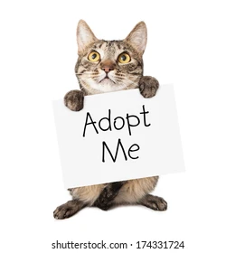

Application Name
>pet store

## **Description**

#### This website was created to help injured domestic animals & pets to get the necessary help and medication they need as well as get new home for the homeless
 >The table below gives shows the different animals. 

 |Animal| Type| Age |
 | --- | ---| ---|
 |5 | Cats| 2 -8 months|
 |10 | Dogs| 2 -10 months|
 |10 | Rats| 1 -6 months|
## **contributors**

#### The website project was fully done by: **Brian Khaifah**

## **Setup/Installation**

#### No installation required.You only need access with a connected device to the internet with working browser(Chrome browser is advisable)

##  **known Bugs**
#### There are no Bugs on this file but should you experience any difficulties in accessing or getting the information you need, or come across anything kindly share with me via my

Personal
[Email](brian.obuom@student.moringaschool.com)
## **Technology Used**
#### _There are no advanced or complicated technology that was used in making this file except for the ones in access to all developers and best suited for different browser._
This are:***_Visual Studio,Html,Css,Readme_***
       

## **License**
Copyright (c) 2021 BrianKhaifah

Permission is hereby granted, free of charge, to any person obtaining a copy of this software and associated documentation files (the "Software"), to deal in the Software without restriction, including without limitation the rights to use, copy, modify, merge, publish, distribute, sublicense, and/or sell copies of the Software, and to permit persons to whom the Software is furnished to do so, subject to the following conditions:

The above copyright notice and this permission notice shall be included in all copies or substantial portions of the Software.

THE SOFTWARE IS PROVIDED "AS IS", WITHOUT WARRANTY OF ANY KIND, EXPRESS OR IMPLIED, INCLUDING BUT NOT LIMITED TO THE WARRANTIES OF MERCHANTABILITY, FITNESS FOR A PARTICULAR PURPOSE AND NONINFRINGEMENT. IN NO EVENT SHALL THE AUTHORS OR COPYRIGHT HOLDERS BE LIABLE FOR ANY CLAIM, DAMAGES OR OTHER LIABILITY, WHETHER IN AN ACTION OF CONTRACT, TORT OR OTHERWISE, ARISING FROM, OUT OF OR IN CONNECTION WITH THE SOFTWARE OR THE USE OR OTHER DEALINGS IN THE SOFTWARE.